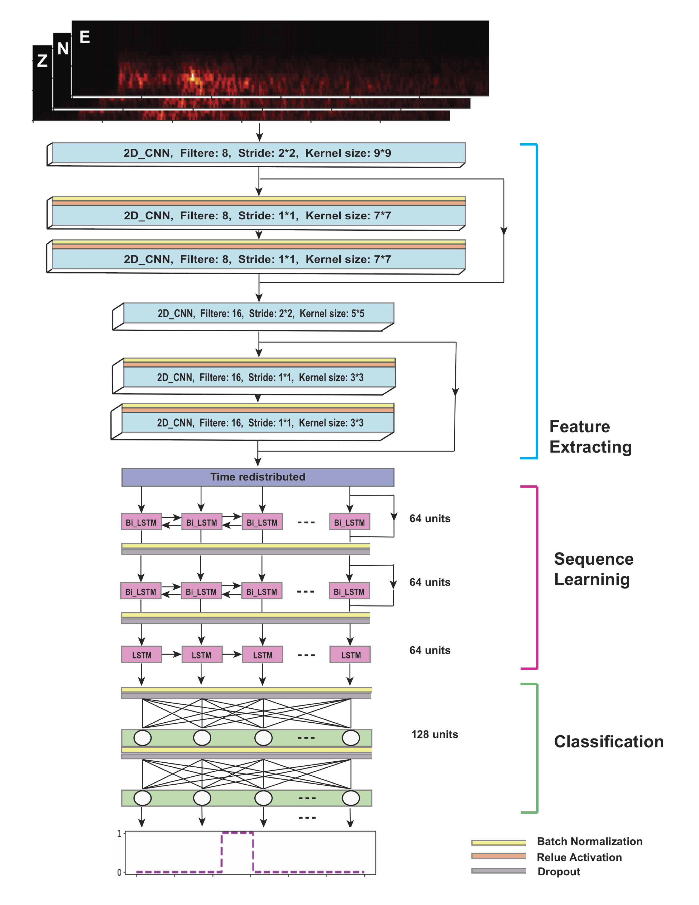

# CRED   
## Convolutionl Recurent Earthquake Detector

### This repository contains the codes to train and test the network proposed in:             

`Mousavi, S. M., Zhu, W., Sheng, Y., & Beroza, G. C. (2019). CRED: A deep residual network of convolutional and recurrent units for earthquake signal detection. Scientific reports, 9(1), 1-14.`
      
------------------------------------------- 
### Installation:

   `pip install -r requirements.txt`
   
------------------------------------------- 
     
### BibTeX:
   
    @article{mousavi2019cred,
      title={CRED: A deep residual network of convolutional and recurrent units for earthquake signal detection},
      author={Mousavi, S Mostafa and Zhu, Weiqiang and Sheng, Yixiao and Beroza, Gregory C},
      journal={Scientific reports},
      volume={9},
      number={1},
      pages={1--14},
      year={2019},
      publisher={Nature Publishing Group}
    }

------------------------------------------- 

### Paper: 

Link 1:
(https://www.nature.com/articles/s41598-019-45748-1)

Link 2:
(https://www.researchgate.net/publication/334490465_CRED_A_Deep_Residual_Network_of_Convolutional_and_Recurrent_Units_for_Earthquake_Signal_Detection)

------------------------------------------- 

### Short Description:

Earthquake signal detection is at the core of observational seismology. A good detection algorithm should be sensitive to small and weak events with a variety of waveform shapes, robust to background noise and non-earthquake signals, and efficient for processing large data volumes. Here, we introduce the Cnn-Rnn Earthquake Detector (CRED), a detector based on deep neural networks. CRED uses a combination of convolutional layers and bi-directional long-short-term memory units in a residual structure. It learns the time-frequency characteristics of the dominant phases in an earthquake signal from three component data recorded on individual stations. 

   

